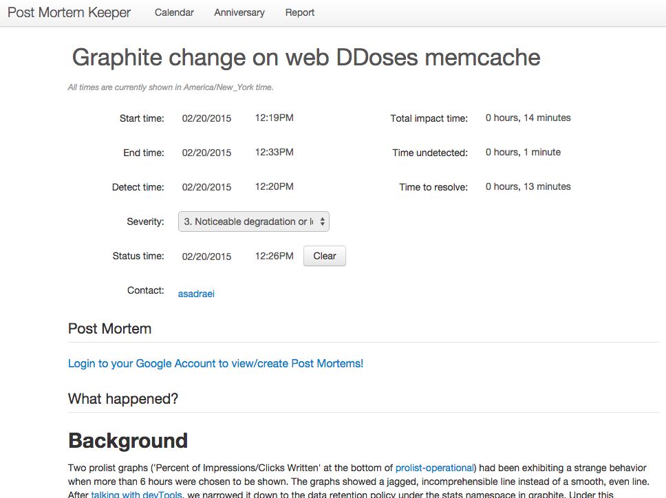
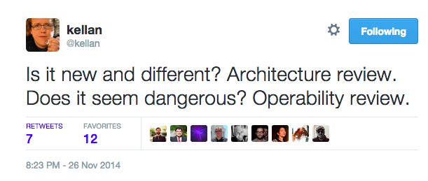

build-lists: true
# Building A Successful Organization By Mastering Failure

### John Goulah (@johngoulah)

#### Etsy

---

^ A marketplace for people around the world to connect, buy, and sell unique goods 

^ Our mission is to re-imagine commerce in ways that build a more fulfilling and lasting world

---

# Marketplace

- $1.93B Annual GMS 2014
- 1.4M active sellers
- 20M+ active buyers
- 30% international GMS
- 57%+ mobile visits

^ a little about the marketplace

---

# Infrastructure

- over 5500 MySQL databases
- 750K graphite metrics/min
- 1.3GB logs written/min
- 50M - 75M gearman jobs / day
- 30-50 deploys / day

^ some interesting facts about the scale of our infrastructure

---

# Company

- Headquartered in Brooklyn
- Over 700 employees
- 7 offices around the world
- 80+ dogs

---

# Values

^ we are a values driven company

---

^ values are the guardrails in our path towards the mission, and everything is surrounded by the culture

<!---

# Company Values

- We are a mindful, transparent, and humane business
- We plan and build for the long term
- We value craftmanship in all we make
- We believe fun should be part of everything we do
- We keep it real, always
-->

<!-- good notes here: https://jira.etsycorp.com/confluence/display/COM/Communicating+in+Ways+that+Align+with+Etsy's+Values -->

---

# Learning Org

a company that facilitates the learning of its members and continuously transforms itself

^ Peter Senge is a systems scientist who is a sr lecturer at MIT and founder of the Society for Organizational Learning

^ this concept was coined through the work and research of Senge and his colleagues ; it encourages more interconnected way of thinking

---

# Five Disciplines

^ Senge is the author of book The Fifth Discipline: The Art and Practice of the Learning Organization.

^ He popularized the concept of the learning organization through his book The Fifth Discipline. In the book, he proposed the following five disciplines

---

# Systems Thinking 

process of understanding how people, structure, and processes influence one another within a larger system

^ Organizations are a system of interrelationships. To become more successful we need to analyze these relationships and find the problems in them. This will allow an organization to eliminate the obstacles to learning

^ But important to view  "problems" as parts of an overall system, rather than reacting to specific parts, outcomes or events, and thereby potentially contributing to further development of unintended consequences.

---

# Personal Mastery 

an individual holds great importance in a learning organization.

^ Continuous self-improvement holds as much importance as commitment and work for the organization. Employees need to grow and work on their own goals.

---

# Mental Models 

the assumptions held by individials and organizations.

^ This is the company culture and the diverse theories and mindsets that serve as a framework for the functioning of the organization. Learning organizations look for how these affect organizational development.

^ important to replace confrontational attitudes with an open culture that promotes inquiry and trust

---

# Shared Vision 

creates a common identity that provides focus and energy for learning.

^ A learning organization's employees all share a common vision. Personal goals must be in sync with the goals and vision of the organization.

^ The most successful visions build on the individual visions of the employees at all levels of the organization

---

# Team Learning 

the problem solving capacity of the organization is improved through better access to knowledge and expertise.

^ Requires individuals to engage in dialogue and group discussion. For a team to learn, they must be in sync and reach agreement.

^ Therefore team members must develop open communication, shared meaning, and shared understanding.

---

# Learning About Failure

- architecture reviews
- operability reviews
- blameless post mortems

^ these things all come together when we work together to learn about failures

^ and these are some meetings that we use

---

# failure and success come from the same source

^ they come from the same source,  ordinary work, only difference in failure
things have come together in unexpected way

^ some of the things that I listed as learning tools such as arch/op reviews, failure hasn't yet happened

---

# context

^ some alignment of random variables in the system causes context to change

---

# can study the system at any time

^ if field experts study the system, you can find the same things you would in a postmortem, presumably before they even happen

---

# three inflection points

- architecture reviews
    - early feedback and discussion
- operability reviews
    - hold before launching
- blameless post mortems
    - hold after a failure

^ inflection points in the product lifecycle 

---

# Architecture Reviews

---

# Architecture Reviews

understand the costs and benefits of a proposed solution, and discuss alternatives

---

# Etsy Tech Axioms

- we use a small number of well known tools. 
- all technology decisions come with trade offs. With new technology, many of those trade offs are unknown.
- we’re growing. things change.

^ have to show our tech axioms to get understanding of why we examine new methods and departures 

---

# [fit] with new technology

# [fit] many of those tradeoffs are unknown

^ we want to examine these tradeoffs that new technology introduces

---

# Departures

a departure is when new technologies or patterns are introduced that deviate from the current known methods of operating the system and maintaining the software

^ we call these new technologies departures

^ this includes new languages, new database systems, or a new templating pattern

---

# How do I know I need an architecture review?

when there is a perceived departure from current technology choices or patterns

^ in other words some new tech we don't have experience with

---

# How early do you hold them?

early enough to be able to bail out or make major course corrections

---

# Who should come?

- the people presenting the change
- key stakeholders (sr. engineers, or arch review working group)
- everyone else that wants to learn about the proposed changes to the system

---

# Architecture Review
# Meeting Format

^ now lets talk about the format and expectations

---

# Preparation

- a proposal is written in a shared document and circulated
- comments are added, discussed, and potentially resolved in advance
- initial questions for the meeting are collected in a tool such as google moderator

^ some work done to avoid the longest meeting ever...

^ proposal should cover goals, mapping design onto goals, departures from existing tech, alternatives and why they weren't used, costs and pain points

---

# Some General Questions

- Do we understand the costs of this departure?  
- Have we asked hard questions about trade-offs?
- What will this prohibit us from doing in the future?

---

# Some General Questions (cont)

- Are we impacting visibility, measurability, debuggability and other operability concerns?
- Are we impacting testability, security, translatability, performance and other product quality concerns?
- Does it makes sense?

---

# The Arch Review

- proposal is presented to the group
- discuss questions and concerns
- decide if we are moving forward or need further discussion

---

# You're saying my project might not move forward?

---

#### (maybe)

---

# Why might this end a project?

- we learned through this discussion that an alternative is better
- we find goals overlap with other projects that are in progress
- we discover that it isn't worth the costs now that we have a better idea what they are

---

# At the end we should have

- detailed notes from the conversation 
- agreement on tricky components and document 
- a compilation of learnings and questions
- a decision of whether to keep going with the project, stop and rethink, or gather more information

---

# Operability

# Reviews

---

# Operability Reviews

Understand how could the system break, how will we know, and how will we react?

---

# When Do We Do Operability Reviews?

- After archtecture reviews in the product lifecycle, generally right before launch
- When we need to gain increased confidence for launch due to the the technology, product, or communication choices being risky
- If there's a chance you'd surprise teams that operate the software

---

# Who comes to the Operability Review?

representatives from:

- Product
- Development
- Operations
- Community/Support
- QA

---

# Some Questions

- Has the feature been tested enough to deploy to production?
- Does everyone know when it will go live, and who will push the feature?
- Is there communication about the feature ready to go out with the feature?
- Is it possible to turn up this feature on a percentage basis, dark launch, or gameday it?

^ percentage may be to staff first

^ (explain dark launch and gameday)

^ communication - community/blog post/forums/etc

---

# Some Questions (cont)

- Does the launch involves any new production infrastructure? 
    - If so, are those pieces in monitoring or metrics collection?
    - If so, is there a deployment pipeline in place?
    - If so, is there a development environment set up to make it work in dev?
    - If so, are there tests that can be and are run on CI?

^ none of these can be "no"

---

# Contingency Checklist

---

# Contingency Checklist

a list of things that could possibly go "wrong" with a new feature, what we could do about it

---

# Issue

What could possibly go wrong with the feature launched in production?

^ This is intentionally vague, because of course there's a multitude of things that can go wrong at any time. This is meant to assume that the site is stable before launch, and anything that could 'go wrong' is a result of introducing the change which is this new feature.

---

# Likelihood

What is the likelihood of each item going wrong?

^ this is a gut check based on things like: capacity of the various backend services touched by the feature

---

# Comments

Any comments about the item?

^ further description of issue and how it may be mitigated if it does happen (short/long term)

---

# Impact

This is just a measure of how impactful this will be if it *does* actually turn out to be a concern.

^ Example: "High"

---

# Engineering

What do we do to mitigate the issue with the item (i.e. can we gracefully degrade?)

^ This is where we indicate what the wire on/off flag is to turn off this part of the feature that is introducing issues.

^ Example: Set disable_coffee_favorites_page = 1

---

# Onsite Messaging

What is the messaging to the user in the forums/blog/etc. if this needs graceful degradation?

^ This is where we have some basic information to tell the user, in the various places on the site.

---

# PR

Is PR needed for the contingency (i.e. larger scale failure, etc.)

^ This is the real worst-case communication, if needed.

---

# Post 

# Mortems

---

# What is a post mortem?

a postmortem is a facilitated meeting during which people involved/interested/close to an accident or incident debriefs together on how we think the event came about

---

# What does it cover?

- going through a timeline of events
- learning how things are expected to work ‘normally’, adding the context of everyone’s perspective
- exploring what we might do to improve thing for the future

---

# local rationality

we want to know how it made sense for someone to do what they did *at the time*

---

# searching for second stories instead of human error

- asking **why** is leading to *who* is responsible
- asking **how** leads to *what*

^ second stories are where we dig deeper into the circumstance and environment that an engineer found themselves in

^ used to help understand what went wrong

---

# Avoiding Human Error

**Human error** points to individuals in a complex system. But, in complex systems, system behaviour is driven fundamentally by the goals of the system and the system structure. People just provide the flexibility to make it work.

<!--http://humanisticsystems.com/2013/09/21/human-error-the-handicap-of-human-factors-safety-and-justice-->

---

# Recognizing Human Error

- be aware of other terms for it: slip, lapse, distraction, mistake, deviation, carelessness, malpractice, recklessness, violation, misjudgement, etc
- don’t point to individuals when you really want to understand system itself and the work
- how do you feel when something goes wrong - is it to find who did it / who screwed up,  or to find how it happened

---

# Human error (cont)

implies deviation from “normal” or ideal, but in complex situations and tasks there is often no normal ideal that can be precisely and exactly described, many variable interconnected touchpoints influence decisions that are made

---

# Other Things to Avoid

<!-- https://www.flickr.com/photos/40326422@N00/4679317079 -->

---

# Root Cause

- it leads to a simplistic and linear explanation of how events transpired
- linear mental models of causality don’t capture what is needed to improve the safety of a system
- ignores the complexity of an event, which is what should be explored if we are going to learn
- leads directly to blaming things on human error

^ there is no such thing as root cause

---

# Hindsight Bias

inclination, after an event has occurred, to see the event as having been predictable, despite there having been little or no objective basis for predicting it

^ given what people knew at the time, and given the choices they made based on that, it wasn't possible for the people involved to avoid it

---

# Counterfactuals

the human tendency to create possible alternatives to life events that have already occurred; something that is contrary to what actually happened

^ Counterfactual thinking is exactly as it states: "counter to the facts."

^ could have, should have, would have

---

# Post Mortem

# Meeting Format

---

# Meeting Format

- Timeline
- Discussion
- Remediation Items

---

# Timeline

- a rough timeline scaffolding is required (usually starting with IRC logs)
- talk about facts that were known at the time, even if hindsight reveals misunderstandings in what we knew
- look out for knowledge that some people were aware of, that others were not, dig into that
- no judgement about actions or knowledge (counterfactuals)
- tell people to hold that thought if they jump to remedation items at this point

---

# Timeline (cont)

- continually ask "What are we missing?" until those involved feel its complete
- continually ask "Does everyone agree this is the order in which events took place?"
- make sure to include important times for events that happened (alerts, discoveries, etc)
- reach a consensus on the timeline and move on to the discussion

---

# Discussion

- When an action or decision was taken in the timeline, ask the person: "Think back to what you knew **at the time**, why did that action make sense to you at the time?"
- Did we clean up anything after we were stable, how long did it take?
- Was there any troubleshooting fatigue?

---

# Discussion (cont)

- Did we do a good job with communication (site status, support, forums, etc)?
- Were all tools on hand and working, ready to use when we needed them during the issue? Where there tools we would have liked to have?
- Did we have enough metrics visibility to diagnose the issue?
- Was there collaborative and thoughtful communication during the issue?

---

# Remediation

- Remediation items should have tickets associated with them to follow up on
- There can be further post meeting discussion on these but tasks should not linger
- What things could we do to prevent this exact thing from happening in the future?
- What things could we do to make troubleshooting similar incidents in the future easier?

^ question wrt tools, alerts, metrics, procedures, etc.

---

# Morgue

## https://github.com/etsy/morgue

---

# In Summary

---

# We Can Learn Before and After Failure

---

# Before

- Architecture reviews for new technology
- Operability reviews to gain launch confidence

<!--

# Summary of Arch vs. Op

-->

---

# After

- Postmortems are done soon after a failure

^ can be any severity level, doesn't have to be technical

^ have done them for performance reasons

---

# Questions?

#### John Goulah (@johngoulah)

#### Etsy
