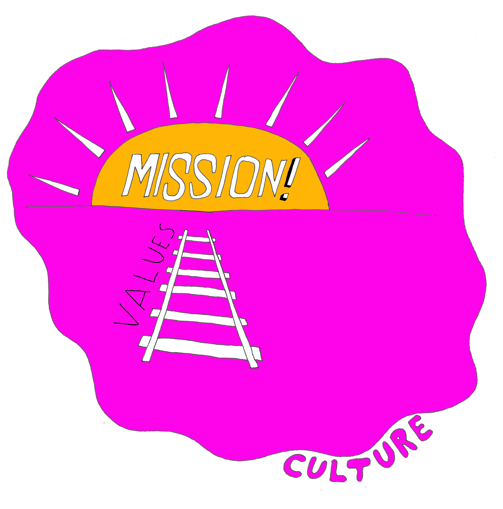

# Building A Successful Organization By Mastering Failure

### John Goulah
### Etsy

---

^ some presenter notess

---

# Marketplace

- $1.93B Annual GMS 2014
- 1.4M active sellers
- 20M+ active buyers
- 30% international GMS
- 57%+ mobile visits

---

# Infrastructure

- 3XXX MySQL databases (find this0)
- someting about gearman workers
- something about statsd metrics
- 30-50 deploys / day

---

# Company

- Headquartered in Brooklyn
- Over 700 employees
- 7 offices around the world
- 80+ dogs

---

# Values

---

---

# Values

- We are a mindful, transparent, and humane business
- We plan and build for the long term
- We value craftmanship in all we make
- We believe fun should be part of everything we do
- We keep it real, always

<!-- good notes here: https://jira.etsycorp.com/confluence/display/COM/Communicating+in+Ways+that+Align+with+Etsy's+Values -->

---

# Learning Org

a company that facilitates the learning of its members and continuously transforms itself

^ concept was coined through the work and research of Peter Senge and his colleagues ; encourages more interconnected way of thinking

<!--

^  Senge popularized the concept of the learning organization through his book The Fifth Discipline. In the book, he proposed the following five disciplines

Systems thinking: Organizations are a system of interrelationships. To become more successful we need to analyze these relationships and find the problems in them. This will allow an organization to eliminate the obstacles to learning
Personal mastery: An individual holds great importance in a learning organization. Continuous self-improvement holds as much importance as commitment and work for the organization. Employees need to grow and work on their own goals.
Mental models: This is the company culture and the diverse theories and mindsets that serve as a framework for the functioning of the organization. Learning organizations look for how these affect organizational development.
Shared vision: A learning organization's employees all share a common vision. Personal goals must be in sync with the goals and vision of the organization.
Team learning: The importance of dialogue and group discussion. For a team to learn, they must be in sync and reach agreement.

-->
---

# Learning about failure

- Architecture Reviews
- Operability Reviews
- Blameless Post Mortems

